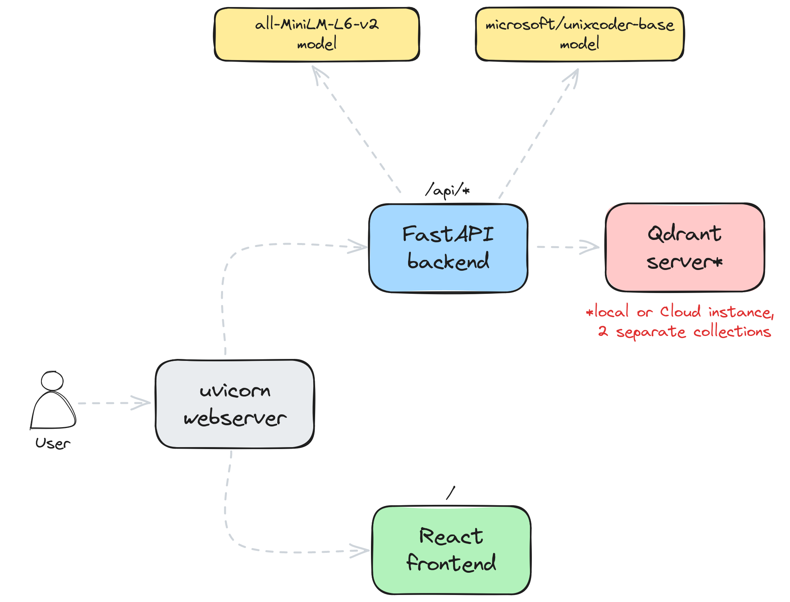

# Code search with Qdrant

Developers need a code search tool that helps them find the right piece of code. In this README, we describe how
you can set up a tool that provides code results, in context.

## Online version

See our code search tool "in action." Navigate to 
**[https://code-search.qdrant.tech/](https://code-search.qdrant.tech/)**. We've prepopulated the demo with Qdrant 
codebase. You can see the results, in context, even with relatively vague search terms.

## Prerequisites

To run this demo on your own system, install and/or set up the following components:

- [Docker](https://www.docker.com/)
- [Docker Compose](https://docs.docker.com/compose/)
- [Rust](https://www.rust-lang.org/learn/get-started)
- [rust-analyzer](https://rust-analyzer.github.io/)

Docker and Docker Compose setup depends on your operating system. Please refer to the official documentation for
instructions on how to install them. Both Rust and rust-analyzer can be installed with the following commands:

```shell
curl --proto '=https' --tlsv1.2 -sSf https://sh.rustup.rs | sh
rustup component add rust-analyzer
```

## Description

You can set up [Qdrant](https://qdrant.tech) to help developers find the code they need, with context. Using semantic
search, developers can find the code samples that can help them do their day-to-day work, even with:

- Imprecise keywords
- Inexact names for functions, classes or variables
- Some other code snippets

The demo uses [Qdrant source code](https://github.com/qdrant/qdrant) to build an end-to-end code search application that
helps you find the right piece of code, even if you have never contributed to the project. We implemented an end-to-end
process, including data chunking, indexing, and search. Code search is a very specific task in which the programming 
language syntax matters as much as the function, class, variable names, and the docstring, describing what and why. 
While the latter is more of a traditional natural language processing task, the former requires a specific approach. 
Thus, we use the following neural encoders for our use cases:

- `all-MiniLM-L6-v2` - one of the gold standard models for natural language processing
- `microsoft/unixcoder-base` - a model trained specifically on a code dataset

### Chunking and indexing process

Semantic search works best with _structured_ source code repositories, with good syntax, as well as best practices
as defined by the authoring team. If your code base needs help, start by dividing the code into chunks. Each
chunk should correspond to a specific function, struct, enum, or any other code structure that might be considered as a whole.

There is a separate model-specific logic that extracts the most important parts of the code and converts them
into a format that the neural network can understand. Only then, the encoded representation is indexed in the Qdrant 
collection, along with a JSON structure describing that snippet as a payload.

To that end, we work with the following models. The combination is the "best of both worlds."

#### all-MiniLM-L6-v2

Before the encoding, code is divided into chunks, but contrary to the traditional NLP challenges, it contains not only
the definition of the function or class but also the context in which appears. While doing code search it's important 
to know where the function is defined, in which module, and in which file. This information is crucial to present the
results to the user in a meaningful way.

For example, the `upsert` function from one of Qdrant's modules would be represented as the following structure:

```json
{
    "name": "upsert",
    "signature": "fn upsert (& mut self , id : PointOffsetType , vector : SparseVector)",
    "code_type": "Function",
    "docstring": "= \" Upsert a vector into the inverted index.\"",
    "line": 105,
    "line_from": 104,
    "line_to": 125,
    "context": {
        "module": "inverted_index",
        "file_path": "lib/sparse/src/index/inverted_index/inverted_index_ram.rs",
        "file_name": "inverted_index_ram.rs",
        "struct_name": "InvertedIndexRam",
        "snippet": "    /// Upsert a vector into the inverted index.\n    pub fn upsert(&mut self, id: PointOffsetType, vector: SparseVector) {\n        for (dim_id, weight) in vector.indices.into_iter().zip(vector.values.into_iter()) {\n            let dim_id = dim_id as usize;\n            match self.postings.get_mut(dim_id) {\n                Some(posting) => {\n                    // update existing posting list\n                    let posting_element = PostingElement::new(id, weight);\n                    posting.upsert(posting_element);\n                }\n                None => {\n                    // resize postings vector (fill gaps with empty posting lists)\n                    self.postings.resize_with(dim_id + 1, PostingList::default);\n                    // initialize new posting for dimension\n                    self.postings[dim_id] = PostingList::new_one(id, weight);\n                }\n            }\n        }\n        // given that there are no holes in the internal ids and that we are not deleting from the index\n        // we can just use the id as a proxy the count\n        self.vector_count = max(self.vector_count, id as usize);\n    }\n"
    }
}
```

> Please note that this project aims to create a search mechanism specifically for Qdrant source code written in Rust.
Thus, we built a small separate [rust-parser project](https://github.com/qdrant/rust-parser) that converts it into the 
before-mentioned JSON objects. It uses [Syn](https://docs.rs/syn/latest/syn/index.html) to read the syntax tree of the 
codebase. If you want to replicate the project for a different programming language, you will need to build a similar 
parser for that language. For example, Python has a similar library called [ast](https://docs.python.org/3/library/ast.html), 
but there might be some differences in the way the code is parsed, thus some adjustments might be required.

Since the `all-MiniLM-L6-v2` model is trained for more natural language tasks, it won't be able to understand the
code directly. For that reason, **we build a fake text-like representation of the structure, that should be 
understandable for the model**, or its tokenizer to be more specific. Such representation won't contain the actual code, 
but rather the important parts of it, like the function name, its signature, and the docstring, but also many more. All 
the special, language-specific characters are removed, to keep the names and signatures as clean as possible. Only that
representation is then passed to the model.

For example, the `upsert` function from the example above would be represented as:

```python
'Function upsert that does: = " Upsert a vector into the inverted index." defined as fn upsert mut self id Point Offset Type vector Sparse Vector  in struct InvertedIndexRam  in module inverted_index  in file inverted_index_ram.rs'
```

In the properly structured codebase, both module and file names should carry some additional information about the 
semantics of that piece of code. For example, the `upsert` function is defined in the `InvertedIndexRam` struct, which 
is a part of the `inverted_index`, which indicates that it is a part of the inverted index implementation stored in 
memory. It is unclear from the function name itself.

> If you want to see how the conversion is implemented in general, please check the `textify` function in the 
`code_search.index.textifier` module.

#### microsoft/unixcoder-base

In that case, the model focuses specifically on the code snippets. We take the definitions along with the corresponding 
docstrings and pass them to the model. Extracting all the definitions is not a trivial task, but there are various 
Language Server Protocol (**LSP**) implementations that can help with that, and you should be able to [find one for
your programming language](https://microsoft.github.io/language-server-protocol/implementors/servers/). For Rust, we 
used the [rust-analyzer](https://rust-analyzer.github.io/) that is capable of converting the codebase into the [LSIF 
format](https://microsoft.github.io/language-server-protocol/specifications/lsif/0.4.0/specification/), which is a 
universal, JSON-based format for code, regardless of the programming language.

The same `upsert` function from the example above would be represented in LSIF as multiple entries and won't contain
the definition itself but just the location, so we have to extract it from the source file on our own. 

Even though the `microsoft/unixcoder-base` model does not officially support Rust, we found it to be working quite well 
for the task. Obtaining the embeddings for the code snippets is quite straightforward, as we just send the code snippet 
directly to the model:

```rust
/// Upsert a vector into the inverted index.
pub fn upsert(&mut self, id: PointOffsetType, vector: SparseVector) {
    for (dim_id, weight) in vector.indices.into_iter().zip(vector.values.into_iter()) {
        let dim_id = dim_id as usize;
        match self.postings.get_mut(dim_id) {
            Some(posting) => {
                // update existing posting list
                let posting_element = PostingElement::new(id, weight);
                posting.upsert(posting_element);
            }
            None => {
                // resize postings vector (fill gaps with empty posting lists)
                self.postings.resize_with(dim_id + 1, PostingList::default);
                // initialize new posting for dimension
                self.postings[dim_id] = PostingList::new_one(id, weight);
            }
        }
    }
    // given that there are no holes in the internal ids and that we are not deleting from the index
    // we can just use the id as a proxy the count
    self.vector_count = max(self.vector_count, id as usize);
}
```

Having both encoders should help us build a more robust search mechanism, that can handle both the natural language and 
code-specific queries.

### Search process

The search process is quite straightforward. The user input is passed to both encoders, and the resulting vectors are
used to query both Qdrant collections at the same time. The results are then merged with duplicates removed and returned 
back to the user. 

## Architecture

The demo uses [FastAPI](https://fastapi.tiangolo.com/) framework for the backend and [React](https://reactjs.org/) for 
the frontend layer. 



The demo consists of the following components:
- [React frontend](/frontend) - a web application that allows the user to search over Qdrant codebase
- [FastAPI backend](/code_search/service.py) - a backend that communicates with Qdrant and exposes a REST API
- [Qdrant](https://qdrant.tech/) - a vector search engine that stores the data and performs the search
- Two neural encoders - one trained on the natural language and one for the code-specific tasks

There is also an additional indexing component that has to be run periodically to keep the index up to date. It is also
part of the demo, but it is not directly exposed to the user. All the required scripts are documented below, and you can 
find them in the [`tools`](/tools) directory.

The demo is, as always, open source, so feel free to check the code in this repository to see how it is implemented.

## Usage

As every other semantic search system, the demo requires a few steps to be set up. First of all, the data has to be
ingested, so we can then use the created index for our queries.

### Data indexing

Qdrant is used as a search engine, so you will need to have it running somewhere. You can either use the local container
or the Cloud version. If you want to use the local version, you can start it with the following command:

```shell
docker run -p 6333:6333 -p 6334:6334 \
    -v $(pwd)/qdrant_storage:/qdrant/storage:z \
    qdrant/qdrant
```

However, the easiest way to start using Qdrant is to use our Cloud version. You can sign up for a free tier 1GB cluster 
at [https://cloud.qdrant.io/](https://cloud.qdrant.io/).

Once the environment is set up, you can configure the Qdrant instance and build the index by running the following 
commands:

```shell
export QDRANT_URL="http://localhost:6333"

# For the Cloud service you need to specify the api key as well
# export QDRANT_API_KEY="your-api-key"

bash tools/download_and_index.sh
```

The indexing process might take a while, as it needs to encode all the code snippets and send them to the Qdrant.

### Search service

Once the index is built, you can start the search service by running the following commands:

```shell
docker-compose up
```

The UI will be available at [http://localhost:8000/](http://localhost:8000/). This is how it should look like:


You can type in the search query and see the related code structures. Queries might come both from natural language
but also from the code itself. 

## Further steps

If you would like to take the demo further, you can try to:

1. Disable one of the neural encoders and see how the search results change.
2. Try out some other encoder models and see the impact on the search quality.
3. Fork the project and support programming languages other than Rust.
4. Build a ground truth dataset and evaluate the search quality.
